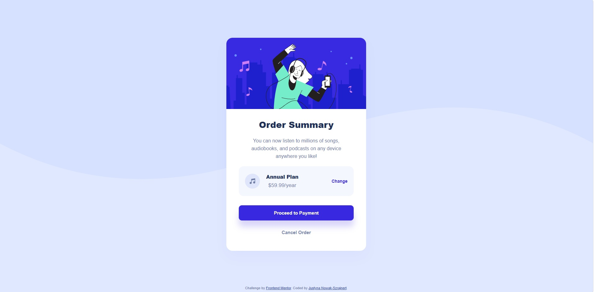
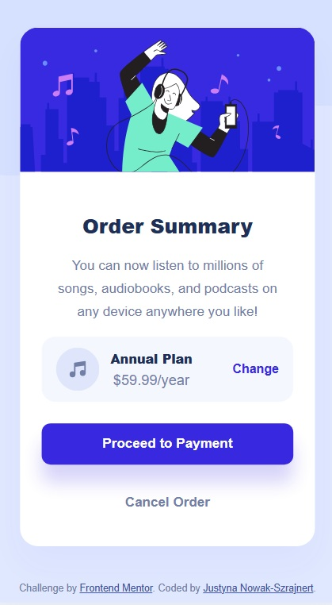
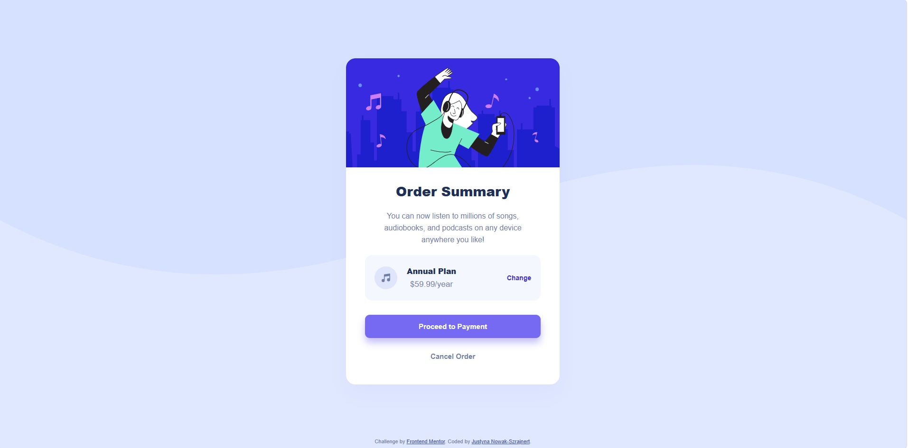
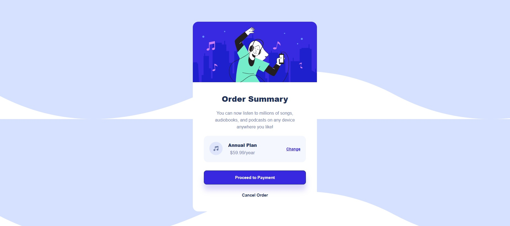

# Frontend Mentor - Responsive order summary card built with Flexbox

This is a solution to the [Order summary card challenge on Frontend Mentor](https://www.frontendmentor.io/challenges/order-summary-component-QlPmajDUj). Frontend Mentor challenges help you improve your coding skills by building realistic projects. 

## Table of contents

- [Overview](#overview)
  - [The challenge](#the-challenge)
  - [Screenshot](#screenshot)
  - [Links](#links)
- [My process](#my-process)
  - [Built with](#built-with)
  - [What I learned](#what-i-learned)
  - [Continued development](#continued-development)
  - [Useful resources](#useful-resources)
  - [AI Collaboration](#ai-collaboration)
- [Author](#author)
- [Acknowledgments](#acknowledgments)

## Overview

### The challenge

Users should be able to:

- See hover states for all interactive elements (buttons and links)
- View the optimal layout depending on their device's screen size (fully responsive layout)
- Experience a robust interface that does not break on extreme screen sizes (very narrow or short viewport dimensions)

### Screenshot

Below are the screenshots showcasing the final implementation of the component, including responsive layouts and interactive states:

#### Desktop View


*The full presentation of the card component optimized for larger desktop viewports, featuring centered alignment and proper card proportions.*

#### Mobile View


*The compact, responsive layout of the card adapted for mobile screens, ensuring text blocks and action items gracefully scale without breaking or truncation.*

#### Active States & Hover Effects

*Demonstration of the interactive state (hover/active) for the "Change" text link, highlighting the smooth color transition and underline removal.*


*Demonstration of the interactive state for the main "Proceed to Payment" button, showcasing the vibrant hover color shifts and deep translucent shadow adaptations.*


*Demonstration of the interactive state for the "Cancel Order" button, highlighting the distinct text color modification when a user hovers over it.*

### Links

- Solution URL: [https://www.frontendmentor.io/solutions/responsive-order-summary-card-built-with-flexbox-MKIRhCgXkh]
- Live Site URL: [https://jusnow1608.github.io/order-summary-component-main/]

## My process

### Built with

- Semantic HTML5 markup
- CSS custom properties (Colors and Fonts)
- Flexbox (for full-page layout, vertical content alignment, and layout blocks)
- Global box-sizing reset (`border-box`)
- Content-driven responsive design using fluid breakpoints

### What I learned

During this challenge, I reinforced my understanding of how default browser styles interact with custom layouts. One of the key breakthroughs was learning how to properly control spacing using Flexbox properties instead of relying on default margins.

For instance, I fixed an awkward layout gap by resetting the default margin of the header element:

```html
<h1 class="plan-title">Order Summary</h1>
```
```css
.plan-title {
  font-size: 28px;
  font-weight: 900;
  color: hsl(223, 47%, 23%);
  margin: 0; /* Resetting user-agent styles to avoid accumulated gaps */
}
```
Transitioning from fixed sizes (width: 360px) to flexible layouts (width: 100%) taught me the immense value of applying a global layout reset, ensuring elements safely respect padding without spilling out:
```css
*, *::before, *::after {
  box-sizing: border-box;
}
```
I also faced and solved major responsive design challenges regarding layout fluidization:

1. Content-Driven Breakpoints: Instead of strictly forcing mobile adjustments at the default 375px, I observed that the layout elements began crowding and text started breaking awkwardly at around 400px. I proactively introduced @media (max-width: 400px) to compact the inner padding and font sizes early. This content-driven approach ensures a smooth presentation across a wider range of intermediate mobile viewports.

2. Mobile Component Compacting: To prevent the component from overflowing shorter devices, I used a structured vertical compression inside the media query. By lowering the hero image height to 160px and slightly trimming the inner element gaps, I achieved a balanced, pixel-perfect layout where everything (including the "Annual Plan" segment) safely stays in a single row without compression artifacts.
```css
@media (max-width: 400px) {
  .plan-details {
    display: flex;
    justify-content: space-between;
    flex-wrap: nowrap; /* Enforces a single row across all mobile screens */
    padding: 12px 16px; 
  }
}
```
### Continued development

In future projects, I want to dive deeper into:

1. Mobile-first workflow: Starting the design from the smallest screen size up, rather than scaling down desktop layouts.

2. Advanced Flexbox & CSS Grid: Gaining more confidence in structuring larger dashboards and complex layout containers without relying on quick fixes.

### Useful resources

MDN Web Docs - Box Sizing - This reference page helped me fully comprehend why padding sometimes causes elements to overflow their container.

A Complete Guide to Flexbox (CSS-Tricks) - An excellent visual resource for understanding alignment and spaces between flex children.

### AI Collaboration

During this challenge, I collaborated with an AI assistant to debug and optimize my code.

What tool do I use: Gemini

How I used it: I used AI as a mentor to figure out why elements were misbehaving on mobile layouts, how layout mechanics handle device scaling, and how to analyze layout errors using screenshot analysis.

What worked well: The assistant guided me through debugging CSS spacing issues without simply writing the entire codebase, reinforcing my knowledge of viewports, flex behaviors, and text rendering rules.


## Author

- GitHub - [@Jusnow1608](https://github.com/Jusnow1608)
- Frontend Mentor - [@Jusnow1608](https://www.frontendmentor.io/profile/Jusnow1608)
- LinkedIn - [@Justyna-Nowak-Szrajnert](https://www.linkedin.com/in/justyna-nowak-szrajnert-a5168713b/)

